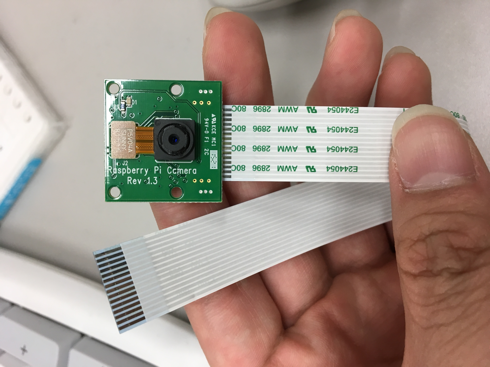
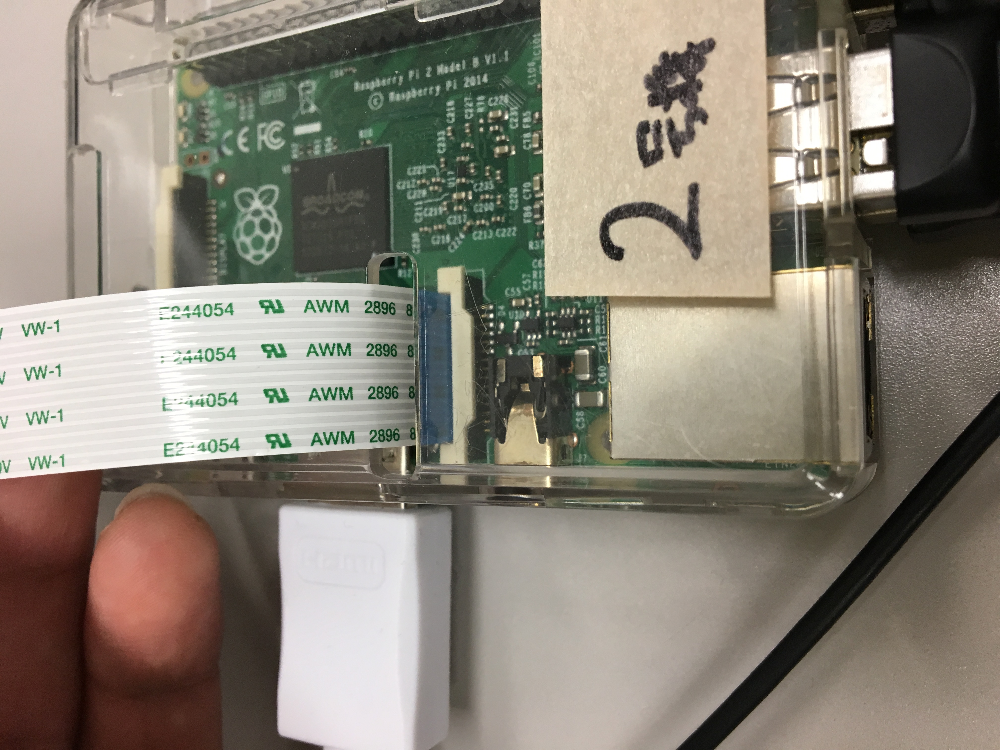

# raspicam  
ラズパイの顔認証  

## raspberry piの初期設定
本プログラムではraspberry piを使用する.以下の手順により初期設定を行う.  

1. 初回起動からSSHログインまで
https://igakilab.gitbooks.io/gt-2016-mojava-manual/content/chapter1/raspberrypi.html  
https://igakilab.gitbooks.io/gt-2016-mojava-manual/content/chapter1/raspi-system-settings.html  
を参考に,raspberry piの初期設定を行う."SSHによるログイン"まで完了させると,同一ネットワークのPCからRLoginやTera TermなどのターミナルソフトでSSH接続できるようになる.  
なお,上記のマニュアルでも述べられているが,キーボードレイアウトおよび言語設定の変更についてはhttp://ryus.co.jp/blog/raspberrypi3-3/を参照することを勧める.GUIベースでの変更が可能であり,比較的簡単である.  

2. カメラの接続および有効化  
本プログラムではraspberry piのカメラモジュールを使用する.以下の記述と写真を参考にカメラモジュールを接続・有効化する.  
なお,モジュールの着脱時はraspberry piの電源を落とすことを推奨する.  
  
  
  
これがカメラモジュールである.これを  
  
  
  
この写真通りに接続する.  
接続が完了したら電源を接続し,raspberry piを起動する.起動後ターミナルを開き,  
sudo raspi-config  
と実行する.するとコンフィグ画面に移行するので,  
Enable Camera -> はい -> Finish  
と選択する.その後再起動を促されるので, <はい> で再起動すればカメラの有効化は完了である.

## プログラムのコンパイルと実行
raspberry pi上で顔認証プログラムを実行するにあたって,リポジトリ上のコードをコンパイルする必要がある.  

1. 前提ライブラリのインストール  
任意の方法でraspberry pi上のターミナルを開き,  
sudo apt-get update  
sudo apt-get install libopencv-dev  
と実行する.なお,これらのコマンドは失敗することがある.その場合は同じコマンドを再度実行すること.

1. リポジトリのクローン  
raspberry pi上にこのリポジトリを以下のコマンドによりクローンする.  
cd ~
git clone git://github.com/igakilab/raspicam  
このコマンドが正常に終了すれば, ~/raspicam に各ファイルがクローンされる.lsコマンドなどで確認すること.

1. 送信先IPアドレスの変更
このプログラムをhttps://github.com/igakilab/webapplicationで利用する場合,送信先IPアドレスの変更が必要である.  
~/raspicam/facesender/sendhr.h にある定義を変更することで,特定マシンへのデータ送信が可能となる.必要ならば,nano等のテキストエディタを用いて変更する.  
```sendhr.h
#define SIMGLINK_URI_HEAD "/LabMemberManager/dwr/jsonp/FaceCollector/addImg"  
#define SIMGLINK_HOST "150.89.xxx.xxx"  //←ここをwebapplicationで使用しているマシンのIPアドレスに変更する.  
#define SIMGLINK_PORTNO 8080  
```  

1. プログラムのコンパイル
以下のコマンドによりコンパイルする.  
mkdir ~/facedetect  
cd ~/raspicam/facesender  
make deploy  

1. プログラムの実行
プログラムはfacesender内のstart.shから実行できる.以下のコマンドを実行すること.  
cd ~/raspicam/facesender
./start.sh